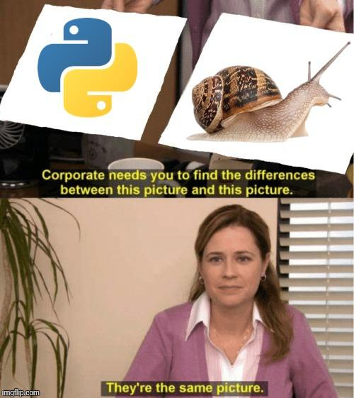
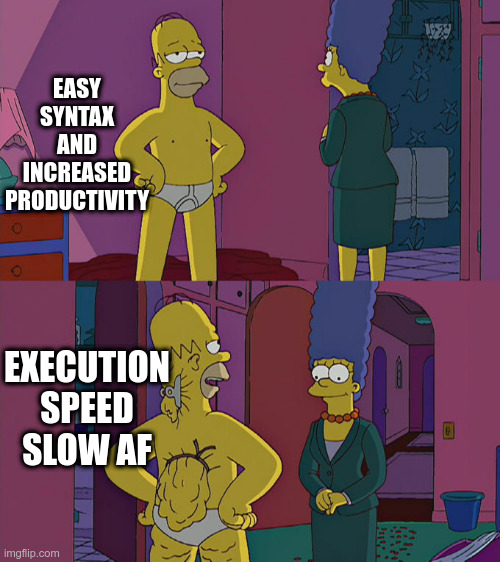

# Week 1

## Table Of Contents

1. [Setup](#setup-%EF%B8%8F)
2. [Python Basics](#python-basics-)
3. [Numpy](#numpy-numerical-python-)
4. [Pandas](#pandas-python-data-analysis-library-)
5. [Matplotlib](#matplotlib-)
6. [Assignment](#assignment-)

## Setup ⚙️

As we set forth to the *Project: Computational Astrophysics*, let us setup our development environment for all the incoming work. Clearing the air beforehand, there is no restriction on your choice of Operaring System for the same. The setup mainly comprises of

### - Command Line (*Windows*) or Terminal (*MacOS/Linux*)
Even though most of our work would be on GUI (Graphical User Interface), it is always benefical to know how to navigate your way around your pc just by typing some commands from your keyboard in that black box of command prompt/terminal. After all, programmers envy using mouse too much 🙃. Check out a few resources for beginners and just get a basic idea of it.
- <https://www.tecmint.com/useful-linux-commands-for-newbies/>
- <https://youtu.be/5XgBd6rjuDQ>

### - Git and Github
For the assignments, we would expect you to make a github repository to keep your work and assignments' solutions and submit the link for the same via a google form, which would soon be floated. So in case you are not familiar with git or github, install git from [here](https://git-scm.com/book/en/v2/Getting-Started-Installing-Git). Very basic feel of git and github can be reduced to a google drive of codes, but there is MUCH more to that. Some awesome learning resources are:

- [Git & GitHub Crash Course For Beginners](https://www.youtube.com/watch?v=SWYqp7iY_Tc)
- [Git Explained in 100 Seconds](https://www.youtube.com/watch?v=hwP7WQkmECE)
- [Basic Git Analogy for Contributing to Open Source Project](https://medium.com/@thesagarsehgal/basic-git-analogy-for-contributing-to-open-source-project-8c314789326e)

### - Python3.x (*recommended x >= 7*) 🐍
As discussed in the introductory session, we will be using python as the programming language for our tasks, chosing it over others due to its user-friendly syntax and learning curve, vast support of libraries and a huge community support among programmers.


Setting up any programming language in general is a two-step process; downloading and installing its binary executable, and second, adding its path to environment variable **PATH**, which is a way of telling the command-line what folders to look in when attempting to find a file. Follow the installation intstructions at:

- Ubuntu: <https://phoenixnap.com/kb/how-to-install-python-3-ubuntu>
- Windows: <https://phoenixnap.com/kb/how-to-install-python-3-windows>
- Mac: <https://flaviocopes.com/python-installation-macos/>


### - Jupyter Notebook

And finally! We are on the last step of our setup. As discussed, working on a notebook eases the process of writing and maintaining code via code snippets in cells. There are two methods to run jupyter notebook, one is installing via old-fashioned python package manager pip, while the second recommended method is to install **Anaconda** (add one more snake to the list XD), as it has already has many other important packages installed.

- (_Recommended_) Install **Anaconda** from [here](https://docs.anaconda.com/anaconda/install/). Run the following command from command prompt/terminal
```bash
jupyter notebook  
```
or directly launch from the Anaconda Navigator. 

- Install jupyter using python-pip
```bash
pip install jupyter
jupyter notebook  
```

Head over to the link you see in the terminal and go through this [link](https://www.dataquest.io/blog/jupyter-notebook-tutorial/) to get familiar with the interface and features of Jupyter Notebook. You can also check out the Jupyter cheat sheet [here](assets/Jupyter_Notebook_Cheat_Sheet.pdf).


## Python Basics 📚

Get familiar with the syntax of the language, and other basic things such as data types, conditionals, loops, functions and file handling from resources here:

- <https://www.w3schools.com/python/>
- <https://www.tutorialspoint.com/python/index.htm>

Try to follow one of the links sincerely and use other for reference help. Main goal right now here is to grasp the understanding of different aspects of the language in breadth, rather than going into depth.

Find `python_basics.ipynb` file in the directory. It covers some conceptual practice questions and revision for basic python.


## Numpy (*Numerical Python*) ⌛

Heavy computational works require dealing with multi-dimensional arrays and matrix data structures. Python lists, in all their brilliance, lack in speed and make them unfit for such tasks. 

<p float="left">


</p>

That's when NumPy, a Python library comes into picture. It has functions for working in domain of linear algebra, fourier transform, and matrices. Some of the learning resources are:

- To start learning and working with a software or a library, it is a very good habit to go through its official documentation first. A documentation is most accurate and would guide you the best in case you encounter bugs: https://numpy.org/devdocs/user/quickstart.html

- A natural question: [NumPy — Why is it so fast?](https://medium.com/swlh/numpy-why-is-it-so-fast-8087f4da4d79)

- I would highly recommend implement the code snippets in this blog in your notebook: [How Fast Numpy Really is and Why?](https://towardsdatascience.com/how-fast-numpy-really-is-e9111df44347)

- There COULD NOT be anything better than [100 NumPy exercises](https://www.kaggle.com/utsav15/100-numpy-exercises) to get that sense of superiority in NumPy. This kaggle link provides you with the answers. you may go through them and read, but the BEST approach is to write that down yourself. 100 exercises can be overwhelming, hence I have selectively added 10 questions in `Numpy.ipynb` file in the directory for you to code yourself.

## Pandas (*Python Data Analysis Library*) 🐼

<p align="center">

</p>

Pandas is a python library which makes it really easy to analyse tabular data. A good and brief video to start learning Pandas would be: https://www.youtube.com/watch?v=dcqPhpY7tWk and then afterwards you can start attempting the notebook. The notebook is mostly self-explanatory and concise but you may use https://pandas.pydata.org/docs/user_guide/index.html to learn more functions that will come in handy. 

Do not worry if you are unable to master Pandas on your first attempt since it might be slightly difficult for beginners. It will become easier with practice. Focus on the other 2 libraries first. 

## Matplotlib 📈

The most commonly used plotting library in python. Really easy to use and offers a wide range of functions for better visualisation of your data. We will only go through the most basic plots this week. Here's a good tutorial to get you started: <https://matplotlib.org/users/pyplot_tutorial.html>. Have fun plotting!

## Assignment 📝

Soon 🚧


### Adios! 👋


