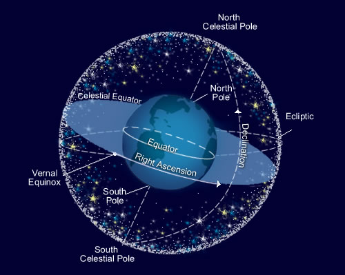

# Week 2

## Table Of Contents

1. [Covered so far](#covered-so-far-%EF%B8%8F)
2. [Astropy](#astropy-astronomical-python)
3. [Scipy](#scipy-scientific-python)
4. [Assignment](#assignment-)

## Covered so far ⚙️

If you are reading this, give a pat on your back! You made it, and didn't lose all the charm for learning in a week! So last week, we grabbed a hold of basics of python, three most popular but useful libraries: Numpy, Pandas and Matplotlib, and finishing off with an assignment. This week, we look forward to explore libraries with deep rooted connection to Astronomy and Mathematical equations.

## Astropy (*Astronomical Python*)

Installation
```bash
pip install astropy
!pip install astropy   # if you are running command in jupyter notebook cell
```

Find `Astropy.ipynb` file in the directory. It covers three topics to get started with Astropy.

- Astropy Constants
- Astropy Units and Quantities
- Astropy Coordinates

<p align="center">

</p>


Recommended Readings:

- [Celestial Sphere](https://www.youtube.com/watch?v=WvXTUcYVXzI)
- [Coordinate Systems in Astronomy](https://adl1995.github.io/an-introduction-to-coordinate-systems-used-in-astronomy.html)
- [Equinox and Epoch](https://oneau.wordpress.com/2011/10/27/equinox-epoch/)
- [Crossmatching in Astronomy](https://www.coursera.org/lecture/data-driven-astronomy/what-is-cross-matching-s0plL)

Although we would covering all the necessary jargon and libraraies, you can always look at some other resources:

- [Learn Astropy](https://learn.astropy.org)
- [Astropy Documentation](https://docs.astropy.org/en/stable/)

## Scipy (*Scientific Python*)

Installation
```bash
pip install scipy
!pip install scipy   # if you are running command in jupyter notebook cell
```

Find `Scipy.ipynb` file in the directory. It covers three topics to get started with Scipy.

- Equation Solver
- Curve Fitting
- Ordinary Differential Equation Solver

Some useful resources:

- [Scipy Doc](https://www.scipy.org/docs.html)
- [Scipy Lectures](https://scipy-lectures.org)

## Assignment 📝

Would be soon uploaded.

### Adios! 👋


