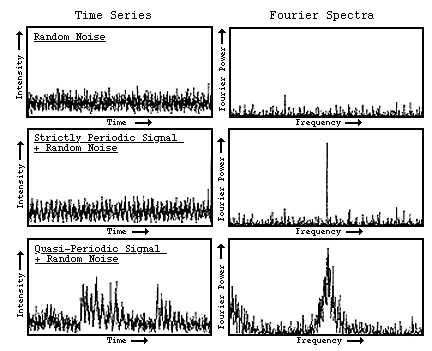
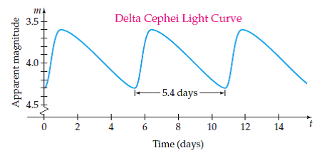
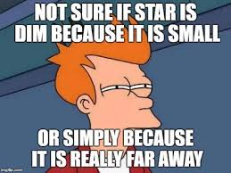

# Week 3

## Table Of Contents

1. [Covered so far](#covered-so-far-%EF%B8%8F)
2. [Fourier Transforms and Periodograms](#fourier-transforms-and-periodograms)
3. [Cepheid Variable Stars](#cepheid-variable-stars)

## Covered so far ⚙️

Last week, we looked at some mathematical tools that are often employed in astronomy and physics in general such as curve fitting and ODE solving. We also started learning Astronomical Python or Astropy and briefly glanced over some modules which makes the process of analysing astronomical data much simpler. This week we shall look at another commonly employed technique in Astronomy i.e [Fourier Transforms.](https://en.wikipedia.org/wiki/Fourier_transform) Afterwards, we shall employ the techniques that we learnt to actually analyse time series data. 

## Fourier Transforms and Periodograms

<p align="center">

</p>

[Periodograms](https://en.wikipedia.org/wiki/Periodogram) are just estimations of the power spectrum. The periodogram that we will use is the [Lomb-Scargle periodogram](https://docs.astropy.org/en/stable/timeseries/lombscargle.html) offered by `astropy.timeseries`. 

### Recommended Readings:

- [3B1B's Video on Fourier Transforms](https://www.youtube.com/watch?v=spUNpyF58BY)
- [Periodic Signals in Astronomy](https://www.youtube.com/watch?v=7STeeVnfYFM) (Only upto 5:50- "How do we detect these signals" )

For some of the modules you will require the `PyAudio` package. To install follow the procedure:

```bash
pip install pyaudio
!pip install audio   # if you are running command in jupyter notebook cell
```

## Cepheid Variable Stars

<p align="center">

</p>

A [Cepheid variable](https://en.wikipedia.org/wiki/Cepheid_variable) is a type of star that pulsates radially, varying in both diameter and temperature and producing changes in brightness with a well-defined stable period and amplitude.

A strong direct relationship between a Cepheid variable's luminosity and pulsation period established Cepheids as important indicators of cosmic benchmarks for scaling galactic and extragalactic distances. ['Imported' from Wiki]

To learn more about Cepheid Variable stars watch these 2 videos by Khan Academy. 

- [Cepheid Variables](https://www.youtube.com/watch?v=BWs-ONRDDG4)
- [Why Cepheids Pulsate?](https://www.youtube.com/watch?v=X_3QAB3o4Vw)

> Well if you do find a better video you can watch it instead. 

<p align="center">

</p>

## Assignment 📝

Find Assignment-2 under folder `Assignment`. Deadline: `June 16, 2021`

### Adios! 👋

